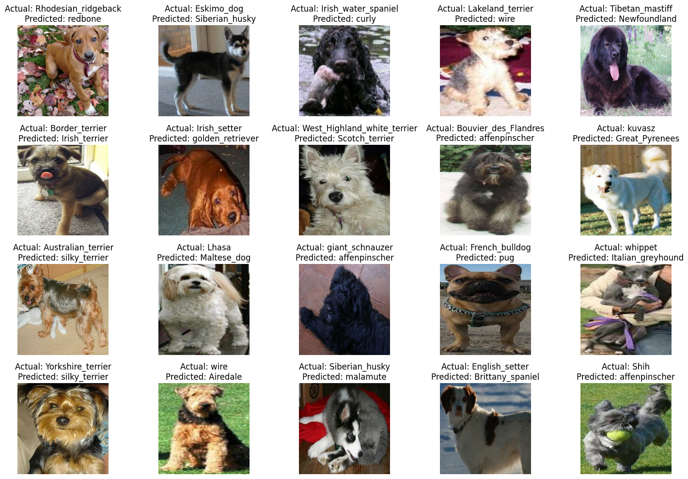

# 🐶 Dog Breed Classification with Deep Learning

This repository contains a deep learning project focused on classifying dog breeds using the [Stanford Dogs Dataset](https://www.kaggle.com/datasets/jessicali9530/stanford-dogs-dataset) from Kaggle. We explore various convolutional neural network (CNN) architectures and preprocessing techniques to accurately identify dog breeds from images.

## Dataset

- **Total Images**: ~20,000 dog images
- **Train Set**: ~16,000 images  
- **Validation Set**: ~2,000 images  
- **Test Set**: ~2,000 images  
- **Classes**: 120 dog breeds  
- **Images per Class**: Approximately 200  

The dataset includes high-resolution images of dogs from 120 different breeds.

## Preprocessing

Before feeding the images into models, several preprocessing steps are applied:

- **Cropping**: Removing irrelevant background for focus on the dog  
- **Augmentation**: Random horizontal flips, rotations, brightness and contrast adjustments  
- **Resizing**: All images resized to **224x224** resolution

## Models

The following deep learning models were used and evaluated:

### Pretrained CNNs

- **ResNet** (e.g., ResNet50)
- **VGG16**
- **Inception V3**

These models were fine-tuned on the dataset using transfer learning to leverage their pretrained weights on ImageNet.

### Custom Models

- **Simple CNN**: A baseline convolutional neural network built from scratch
- **ResNet**: A version of ResNet architecture
- **CNN with Attention**: A CNN architecture enhanced with an attention mechanism to focus on the most informative parts of the image

## Training & Evaluation

Each model is trained and validated using standard metrics such as:

- **Accuracy**
- **Loss (Categorical Cross-Entropy)**

Experiments include comparison between architectures and the impact of attention mechanisms.

## Sample Results

Model predictions include the top-1 and top-5 most probable dog breeds with visualizations showing the confidence levels.

## Error Analysis

An error analysis was conducted on the incorrect predictions made by the Xception V3 model, which achieved the highest test accuracy of 88%. The figure below illustrates the model’s misclassifications.

## Dash App

A dash app can be created with the predictDogs_dashapp.ipynb file for predicting unknown images.

